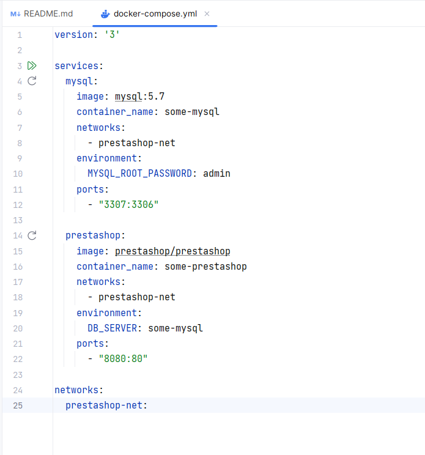
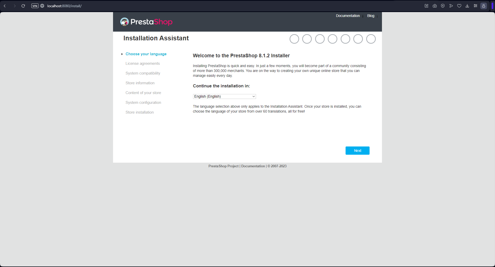

# Examen Docker

### Cristian Moreira Alén 23/10/2023

1. Creamos un proyecto en `PHPStorm` llamado Examen. Dentro de nuestro proyecto creamos un archivo de tipo `yml` llamado **Docker-compose.yml**.

## Editamos el Archivo YML

El cacho de código anterior lo he sacado de esta buena [**página**](https://devdocs.prestashop-project.org/8/basics/installation/environments/docker/).
+ Una vez configurado, el siguiente paso será poner el siguiente comando:

        docker compose up -d
  + El significado del anterior comando es el siguiente:
    + `docker-compose`:  Este comando se utiliza para administrar aplicaciones Docker multi-contenedor. 
    + `up`: El subcomando "up" se utiliza para crear e iniciar los servicios y contenedores definidos en el archivo.
    + `-d`: (No es obligatorio)  Esta opción (modo detached) se utiliza para que los servicios se ejecuten en segundo plano. Esto significa que después de ejecutar docker-compose up -d, los contenedores se ejecutarán en segundo plano sin bloquear la terminal, y podrás seguir utilizando la terminal para otras tareas.

**NOS MOSTRARÁ ALGO TAL QUE ASÍ:**

## Empezamos la cofiguración de PrestaShop

